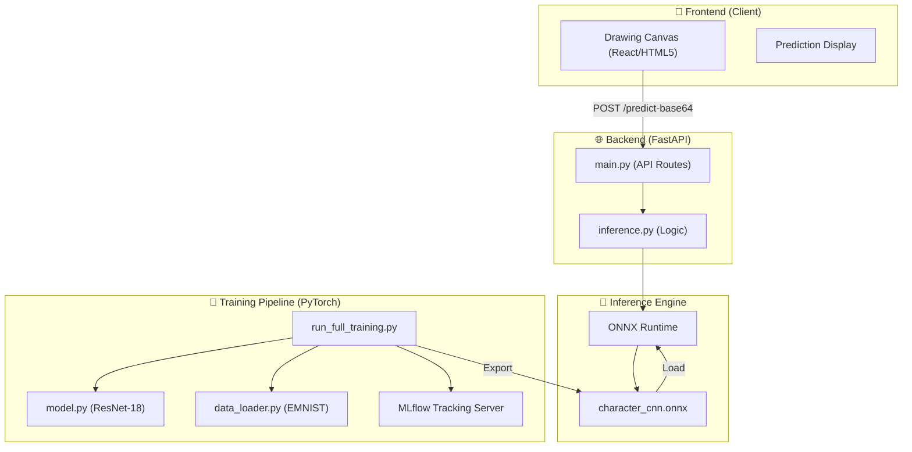

# 🖊️ Handwritten Character Recognition (Task 3)

[](https://www.python.org/)
[](https://pytorch.org/)
[](https://fastapi.tiangolo.com/)
[](https://mlflow.org/)
[](https://onnx.ai/)

A high-performance, deep-learning powered handwriting recognition system designed to identify 62 distinct character classes (0-9, A-Z, a-z). This project implements a robust **ResNet-18** architecture, optimized for speed and accuracy, with a complete end-to-end pipeline from training to real-time web inference.

---

## 🏗️ Architecture Overview

The system is built with a decoupled architecture, ensuring high scalability and low-latency inference.



### Technical Stack

-   **Model Architecture**: Custom **ResNet-18** with residual skip connections to overcome vanishing gradients in deep networks.
-   **Inference Pipeline**: Utilizes **ONNX Runtime** for cross-platform, hardware-accelerated inference.
-   **Experiment Management**: **MLflow** tracks hyperparameters, metrics, and model versions.
-   **API Framework**: **FastAPI** provides a high-performance, asynchronous interface for real-time interaction.
-   **Data Processing**: Optimized orientation correction and normalization for EMNIST datasets.

---

## 📊 Dataset Reference

This project utilizes the **Extended MNIST (EMNIST)** dataset, a standard benchmark for handwritten character recognition.

-   **Dataset**: EMNIST (ByClass Split)
-   **Source**: [Kaggle - EMNIST Dataset by Crawford](https://www.kaggle.com/datasets/crawford/emnist)
-   **Scale**: ~814,255 images
-   **Classes**: 62 (0-9, A-Z, a-z)
-   **Format**: $28 \times 28$ Grayscale (inverted and transposed)

---

## 🧠 Model Architecture

The core recognition engine uses a **ResNet-18** architecture, specifically adapted for single-channel grayscale images.

| Layer Type | Configuration | Output Shape |
| :--- | :--- | :--- |
| **Input** | Grayscale Image | (1, 28, 28) |
| **Initial Conv** | 64 filters, 3x3 | (64, 28, 28) |
| **ResBlock 1** | 2 blocks, 64 filters | (64, 28, 28) |
| **ResBlock 2** | 2 blocks, 128 filters | (128, 14, 14) |
| **ResBlock 3** | 2 blocks, 256 filters | (256, 7, 7) |
| **ResBlock 4** | 2 blocks, 512 filters | (512, 4, 4) |
| **Global Pool** | Adaptive Avg Pool | (512, 1, 1) |
| **Fully Connected**| Softmax Output | (62,) |

---

## 🚀 Installation & Setup

### 1. Environment Setup
Recommended Python version: `3.12`.

```bash
# Clone the repository
git clone https://github.com/Saket745/Internship_Task_3.git
cd Internship_Task_3

# Create and activate virtual environment
python -m venv venv
source venv/bin/activate  # Windows: venv\Scripts\activate

# Install dependencies
pip install -r requirements.txt
```

### 2. Training Workflow
To initiate a full training cycle with MLflow tracking:

```bash
python -m src.ml.run_full_training
```

To view training logs and metrics:
```bash
mlflow ui
```

### 3. Real-time Inference
Deploy the FastAPI server:

```bash
python -m src.api.main
```

Access the interactive drawing dashboard at: `http://localhost:8000`

---

## 🛠️ Project Structure

```text
Task 3/
├── data/               # EMNIST dataset and Kaggle CSVs
├── models/             # Production-ready .onnx and .pth files
├── src/
│   ├── ml/             # Machine Learning logic (PyTorch)
│   │   ├── model.py    # ResNet implementation
│   │   ├── train.py    # Training routines
│   │   └── data_loader.py
│   └── api/            # Inference & Backend (FastAPI)
│       ├── main.py     # API entry point
│       └── static/     # Web-based drawing interface
├── mlruns/             # MLflow local tracking database
└── tests/              # Performance and logic verification
```

---

## ✨ Key Features

-   **State-of-the-Art Accuracy**: ResNet-18 achieves significant gains over traditional CNNs on the 62-class challenge.
-   **Ultra-low Latency**: Optimized ONNX inference for seamless user experience.
-   **Robust Preprocessing**: Custom orientation correction to handle EMNIST's native transposition quirk.
-   **Production Ready**: Asynchronous FastAPI backend designed for concurrency.
-   **Experiment Versioning**: Full traceability of model improvements via MLflow.

---

## 📜 License
This project is for educational purposes as part of an internship program. Dataset licenses follow the original NIST/Kaggle terms.
