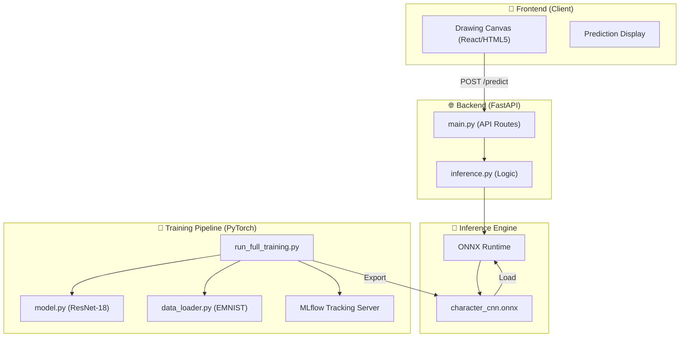

# 🖋️ DeepHandwriting: Alphanumeric Recognition System

[](https://www.python.org/)
[](https://pytorch.org/)
[](https://fastapi.tiangolo.com/)
[](https://mlflow.org/)
[](https://onnx.ai/)
[](LICENSE)

**DeepHandwriting** is a state-of-the-art, deep-learning powered handwriting recognition engine designed to identify 62 distinct character classes (0-9, A-Z, a-z). Leveraging a custom **ResNet-18** architecture and optimized via **ONNX**, it provides ultra-low latency inference for real-time applications.

---

## 🏗️ System Architecture

The architecture is designed for high-throughput and modularity, separating the compute-intensive training pipeline from the low-latency inference service.



### Core Technologies
-   **Model**: **ResNet-18** (Residual Networks) with skip connections to enable deeper learning without accuracy degradation.
-   **Experiment Tracking**: **MLflow** for robust lifecycle management, logging metrics, and artifact versioning.
-   **Inference Engine**: **ONNX Runtime** for hardware-agnostic execution, yielding sub-millisecond response times.
-   **API**: **FastAPI** with asynchronous request handling for scalable production deployments.

---

## 📊 Dataset & Reference

The model is trained on the **Extended MNIST (EMNIST)** dataset, specifically the **ByClass** split, which contains a balanced representation of digits and both case-sensitive letters.

-   **Total Samples**: ~814,255
-   **Classes**: 62 (0-9, A-Z, a-z)
-   **Primary Source**: [Kaggle - EMNIST Dataset by Crawford](https://www.kaggle.com/datasets/crawford/emnist)
-   **Characteristics**: $28 \times 28$ grayscale images, pre-processed with orientation correction and normalization.

---

## 🧠 Model Performance

Based on current training benchmarks on the EMNIST 'ByClass' dataset:

| Metric | Value |
| :--- | :--- |
| **Model Architecture** | ResNet-18 |
| **Accuracy (Top-1)** | **~86.87%** (Epoch 3) |
| **Inference Latency** | < 5ms (CPU/ONNX) |
| **Optimizer** | AdamW |
| **Schedulers** | OneCycleLR |

---

## 🚀 Getting Started

### Prerequisites
- Python 3.12+
- (Optional) CUDA-compatible GPU for training acceleration.

### Installation
```bash
# Clone the repository
git clone https://github.com/Saket745/Internship_Task_3.git
cd Internship_Task_3

# Environment setup
python -m venv venv
source venv/bin/activate  # Windows: venv\Scripts\activate

# Install requirements
pip install -r requirements.txt
```

### Usage
#### 1. Training & Tracking
Execute the full pipeline to train, validate, and export the model:
```bash
python -m src.ml.run_full_training
```
Launch the MLflow dashboard to monitor progress:
```bash
mlflow ui
```

#### 2. Local Deployment
Start the production-ready FastAPI server:
```bash
python -m src.api.main
```
The interactive drawing interface will be available at `http://localhost:8000`.

---

## 🛠️ Project Roadmap

- [x] **Core**: Implement ResNet-18 architecture.
- [x] **Pipeline**: Integrate MLflow and ONNX export.
- [x] **API**: Develop FastAPI inference service.
- [x] **Docs**: Professional README and Master Specification.
- [ ] **Frontend**: Migrate current static UI to a full **React** application.
- [ ] **Infrastructure**: Add **Dockerfile** for containerized deployment.
- [ ] **DevOps**: Setup **GitHub Actions** for automated CI/CD.

---

## 🤝 Contributing
Contributions are welcome! Please follow the existing code style and ensure all tests pass before submitting a Pull Request.

1. Fork the Project
2. Create your Feature Branch (`git checkout -b feature/AmazingFeature`)
3. Commit your Changes (`git commit -m 'Add some AmazingFeature'`)
4. Push to the Branch (`git push origin feature/AmazingFeature`)
5. Open a Pull Request

---

## 📜 License
Distributed under the MIT License. See `LICENSE` for more information.
Dataset license follows the original NIST/Kaggle terms.
