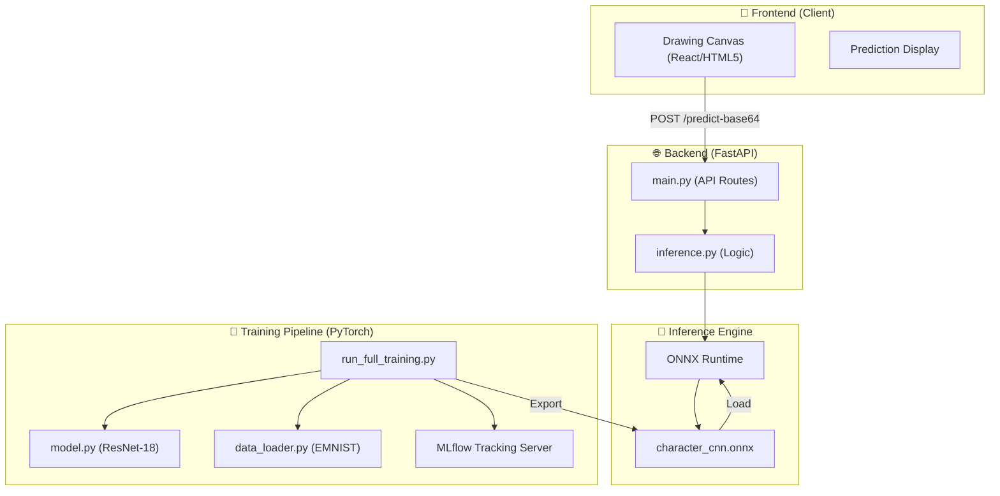

# 🖊️ Handwritten Character Recognition (Task 3)

[](https://www.python.org/)
[](https://pytorch.org/)
[](https://fastapi.tiangolo.com/)
[](https://mlflow.org/)

A high-performance, deep-learning powered handwriting recognition system designed to identify 62 distinct character classes (0-9, A-Z, a-z) from the EMNIST 'ByClass' dataset. This project implements a robust **ResNet-18** architecture, optimized for speed and accuracy, with a complete end-to-end pipeline from training to real-time web inference.

---

## 🏗️ Architecture Overview

The system is built with a modular architecture that separates the training pipeline from the inference service.



### Key Components

-   **Deep Learning Model**: A custom **ResNet-18** implementation tailored for $28 \times 28$ grayscale images. It uses residual blocks to prevent vanishing gradients and achieve higher accuracy on the complex 62-class EMNIST dataset.
-   **Training Pipeline**: Includes GPU-accelerated training, automated data augmentation, and real-time validation metrics.
-   **Experiment Tracking**: Integrated with **MLflow** to track hyperparameters (learning rate, batch size) and metrics (accuracy, loss) across different runs.
-   **Inference Service**: Powered by **FastAPI** and **ONNX Runtime**. The model is exported to ONNX format to ensure ultra-low latency inference in production.
-   **Web UI**: A sleek drawing interface where users can sketch characters and receive instant recognition results with confidence scores.

---

## ✨ Features

-   **Full Alphanumeric Support**: Recognizes 62 classes including digits (0-9), uppercase (A-Z), and lowercase (a-z).
-   **State-of-the-Art Model**: Uses ResNet-18 architecture, providing superior performance compared to standard CNNs.
-   **High Performance**: Model optimized via ONNX for sub-millisecond inference times.
-   **Scalable Backend**: FastAPI implementation supporting concurrent requests and asynchronous processing.
-   **MLOps Ready**: Full MLflow integration for experiment versioning and reproducibility.
-   **GPU Optimized**: Automatic CUDA detection and utilization for training speedups.

---

## 🚀 Getting Started

### 1. Prerequisites
- Python 3.12+
- CUDA-capable GPU (optional, for faster training)
- Git

### 2. Installation
Clone the repository and install dependencies:
```bash
git clone https://github.com/Saket745/Internship_Task_3.git
cd Internship_Task_3
python -m venv venv
source venv/bin/activate  # On Windows: venv\Scripts\activate
pip install -r requirements.txt
```

### 3. Training the Model
To start the full training pipeline with MLflow tracking:
```bash
python -m src.ml.run_full_training
```
You can monitor the training progress by running the MLflow UI:
```bash
mlflow ui
```

### 4. Running the API
Start the FastAPI server:
```bash
python -m src.api.main
```
Access the web interface at `http://localhost:8000`.

---

## 📊 Dataset
The model is trained on the **EMNIST (Extended MNIST)** dataset, specifically the **ByClass** split:
- **Total Images**: ~814,255
- **Classes**: 62 (Digits + Letters)
- **Image Size**: $28 \times 28$ (Grayscale)

---

## 🛠️ Project Structure
```text
Task 3/
├── data/               # Dataset storage
├── models/             # Saved .pth and .onnx models
├── src/
│   ├── ml/             # Training & Model logic
│   │   ├── model.py    # ResNet architecture
│   │   ├── train.py    # Training scripts
│   │   └── data_loader.py
│   └── api/            # Inference & Web logic
│       ├── main.py     # FastAPI application
│       └── static/     # Frontend assets
├── tests/              # Unit tests
└── mlruns/             # MLflow tracking data
```

---

## 🤝 Acknowledgments
- **EMNIST Dataset**: Provided by NIST.
- **Frameworks**: PyTorch, FastAPI, ONNX.
- **Architecture**: Inspired by the ResNet paper (He et al.).
